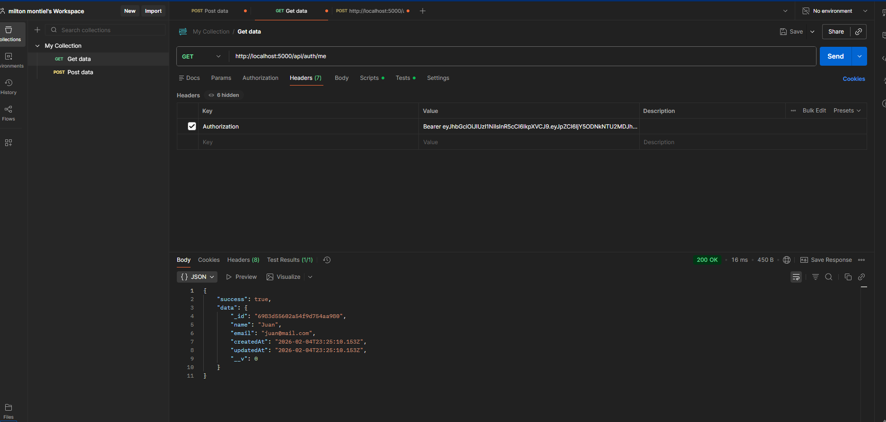
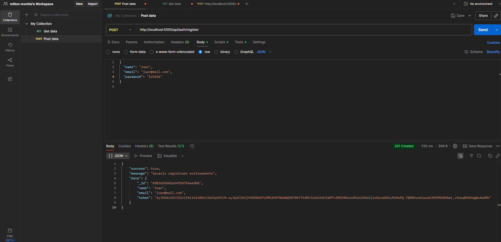
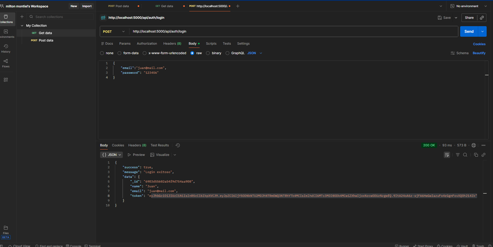
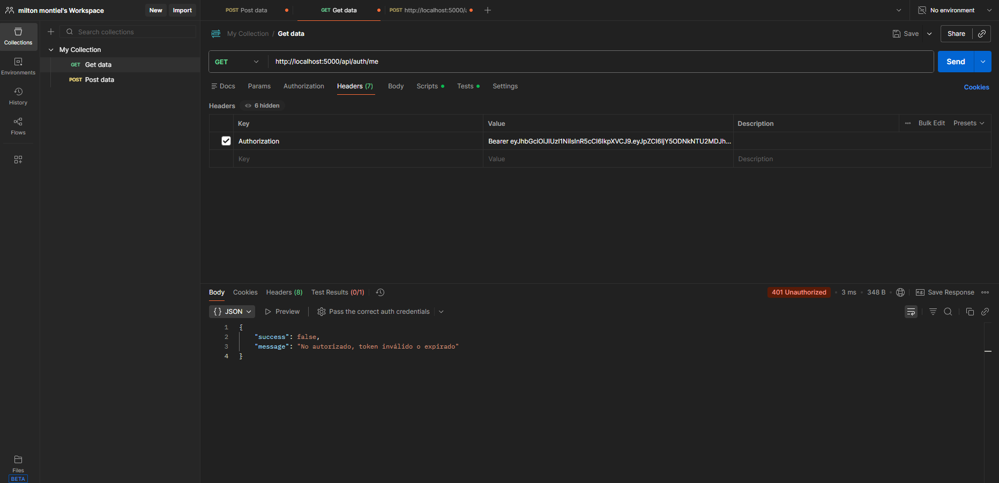

# Node.js Authentication API

API REST completa con autenticación JWT, MongoDB y arquitectura MVC usando Node.js, Express y Mongoose.

## 🚀 Características

- ✅ Autenticación JWT (JSON Web Token)
- ✅ Encriptación de contraseñas con bcrypt
- ✅ Arquitectura MVC (Models, Views, Controllers)
- ✅ CRUD completo de tareas asociadas a usuarios
- ✅ Protección de rutas con middleware de autenticación
- ✅ Manejo de errores global
- ✅ Variables de entorno con dotenv
- ✅ Validaciones con Mongoose
- ✅ CORS habilitado

## 📋 Requisitos previos

- Node.js (v14 o superior)
- MongoDB (local o MongoDB Atlas)
- npm o yarn

## 🔧 Instalación

1. **Clonar el repositorio**

```bash
git clone <url-del-repositorio>
cd nodejs-auth-api
```

2. **Instalar dependencias**

```bash
npm install
```

3. **Configurar variables de entorno**

Crear un archivo `.env` en la raíz del proyecto basándote en `.env.example`:

```env
PORT=5000
NODE_ENV=development
MONGODB_URI=mongodb://localhost:27017/nodejs-auth-api
JWT_SECRET=tu_clave_secreta_super_segura_cambiala_en_produccion
JWT_EXPIRE=7d
```

4. **Iniciar MongoDB**

Si usas MongoDB local:

```bash
mongod
```

Si usas MongoDB Atlas, asegúrate de tener la URI de conexión correcta en `.env`.

5. **Ejecutar el servidor**

Modo desarrollo (con nodemon):

```bash
npm run dev
```

Modo producción:

```bash
npm start
```

El servidor estará corriendo en `http://localhost:5000`

## 📁 Estructura del proyecto

```
nodejs-auth-api/
├── config/
│   └── db.js                 # Configuración de MongoDB
├── controllers/
│   ├── authController.js     # Lógica de autenticación
│   └── taskController.js     # Lógica de tareas
├── middlewares/
│   ├── auth.js               # Middleware de autenticación JWT
│   └── error.js              # Middleware de manejo de errores
├── models/
│   ├── User.js               # Modelo de usuario
│   └── Task.js               # Modelo de tarea
├── routes/
│   ├── auth.js               # Rutas de autenticación
│   └── tasks.js              # Rutas de tareas
├── .env.example              # Ejemplo de variables de entorno
├── .gitignore                # Archivos ignorados por Git
├── package.json              # Dependencias del proyecto
└── server.js                 # Punto de entrada de la aplicación
```

## 🔌 API Endpoints

### Autenticación

#### Registrar usuario

```http
POST /api/auth/register
Content-Type: application/json

{
  "name": "Juan Pérez",
  "email": "juan@example.com",
  "password": "123456"
}
```

**Respuesta exitosa:**

```json
{
  "success": true,
  "message": "Usuario registrado exitosamente",
  "data": {
    "_id": "65abc123...",
    "name": "Juan Pérez",
    "email": "juan@example.com",
    "token": "eyJhbGciOiJIUzI1NiIsInR5cCI6IkpXVCJ9..."
  }
}
```

#### Iniciar sesión

```http
POST /api/auth/login
Content-Type: application/json

{
  "email": "juan@example.com",
  "password": "123456"
}
```

**Respuesta exitosa:**

```json
{
  "success": true,
  "message": "Login exitoso",
  "data": {
    "_id": "65abc123...",
    "name": "Juan Pérez",
    "email": "juan@example.com",
    "token": "eyJhbGciOiJIUzI1NiIsInR5cCI6IkpXVCJ9..."
  }
}
```

#### Obtener perfil del usuario

```http
GET /api/auth/me
Authorization: Bearer <token>
```

### Tareas (Requieren autenticación)

#### Obtener todas las tareas del usuario

```http
GET /api/tasks
Authorization: Bearer <token>
```

**Respuesta exitosa:**

```json
{
  "success": true,
  "count": 2,
  "data": [
    {
      "_id": "65abc456...",
      "title": "Completar proyecto",
      "description": "Terminar el backend de la API",
      "status": "in-progress",
      "priority": "high",
      "user": "65abc123...",
      "createdAt": "2024-01-15T10:30:00.000Z",
      "updatedAt": "2024-01-15T10:30:00.000Z"
    }
  ]
}
```

#### Crear nueva tarea

```http
POST /api/tasks
Authorization: Bearer <token>
Content-Type: application/json

{
  "title": "Nueva tarea",
  "description": "Descripción de la tarea",
  "status": "pending",
  "priority": "medium"
}
```

#### Actualizar tarea

```http
PATCH /api/tasks/:id
Authorization: Bearer <token>
Content-Type: application/json

{
  "status": "completed"
}
```

#### Eliminar tarea

```http
DELETE /api/tasks/:id
Authorization: Bearer <token>
```

## 🔐 Autenticación

Todas las rutas de tareas requieren autenticación mediante JWT. Para acceder, incluye el token en el header:

```
Authorization: Bearer <tu_token_aqui>
```

## 📝 Ejemplos de uso con cURL

### Registrar usuario

```bash
curl -X POST http://localhost:5000/api/auth/register \
  -H "Content-Type: application/json" \
  -d '{
    "name": "Juan Pérez",
    "email": "juan@example.com",
    "password": "123456"
  }'
```

### Login

```bash
curl -X POST http://localhost:5000/api/auth/login \
  -H "Content-Type: application/json" \
  -d '{
    "email": "juan@example.com",
    "password": "123456"
  }'
```

### Crear tarea (con token)

```bash
curl -X POST http://localhost:5000/api/tasks \
  -H "Content-Type: application/json" \
  -H "Authorization: Bearer TU_TOKEN_AQUI" \
  -d '{
    "title": "Nueva tarea",
    "description": "Descripción de la tarea",
    "priority": "high"
  }'
```

### Obtener tareas (con token)

```bash
curl -X GET http://localhost:5000/api/tasks \
  -H "Authorization: Bearer TU_TOKEN_AQUI"
```

## 🛠️ Tecnologías utilizadas

- **Node.js** - Entorno de ejecución de JavaScript
- **Express** - Framework web
- **MongoDB** - Base de datos NoSQL
- **Mongoose** - ODM para MongoDB
- **JWT** - JSON Web Tokens para autenticación
- **bcryptjs** - Encriptación de contraseñas
- **dotenv** - Gestión de variables de entorno
- **cors** - Manejo de CORS

## 📌 Modelos de datos

### User

```javascript
{
  name: String (required, max 50 chars),
  email: String (required, unique, valid email),
  password: String (required, min 6 chars, encrypted),
  timestamps: true
}
```

### Task

```javascript
{
  title: String (required, max 100 chars),
  description: String (max 500 chars),
  status: String (enum: ['pending', 'in-progress', 'completed']),
  priority: String (enum: ['low', 'medium', 'high']),
  user: ObjectId (reference to User),
  timestamps: true
}
```

## Notas importantes

1. **Seguridad**: Cambia el `JWT_SECRET` en producción por una clave segura.
2. **MongoDB**: Asegúrate de que MongoDB esté corriendo antes de iniciar el servidor.
3. **CORS**: Por defecto, CORS está habilitado para todos los orígenes. Configúralo según tus necesidades en producción.
4. **Validaciones**: El modelo incluye validaciones básicas, puedes agregar más según tus necesidades.

## Manejo de errores

La API retorna errores en el siguiente formato:

```json
{
  "success": false,
  "message": "Descripción del error"
}
```
## Colección de pruebas Postman 

: ver usuario

: registrar

: logear

: login expirado ()


Códigos de estado HTTP:

- `200` - Éxito
- `201` - Recurso creado
- `400` - Error de validación
- `401` - No autorizado
- `403` - Prohibido
- `404` - No encontrado
- `500` - Error del servidor

## 👤 Autor

Milton Montiel

---


**¿Necesitas ayuda?** Abre un issue en el repositorio.
